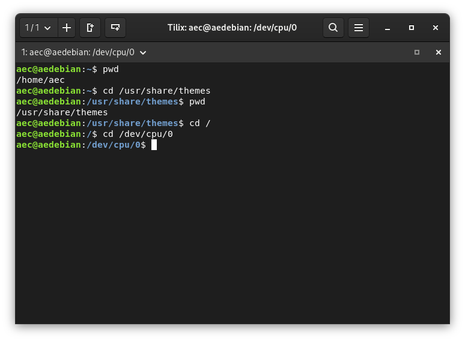
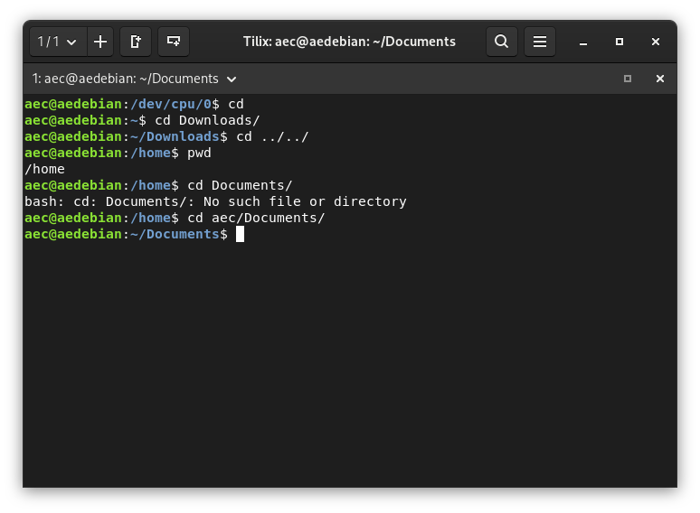
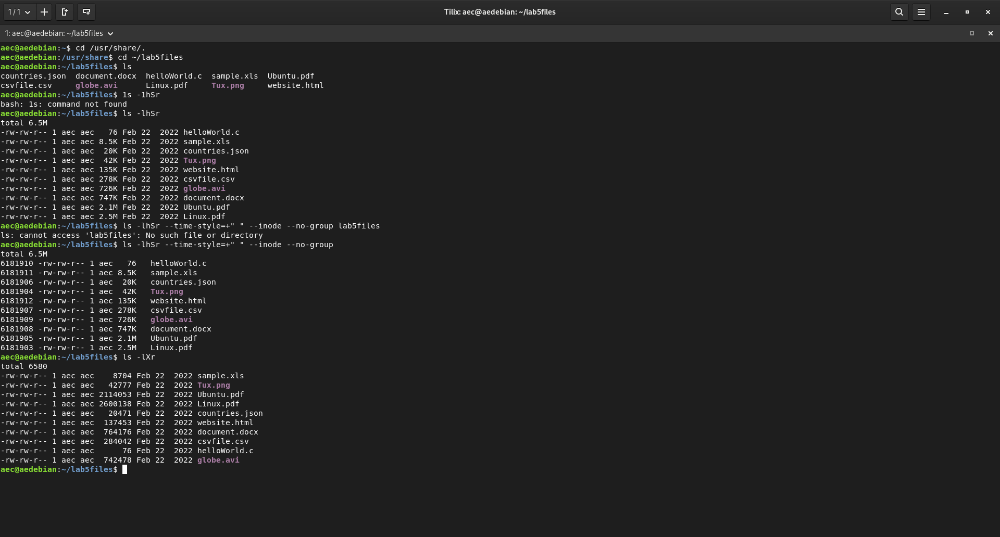
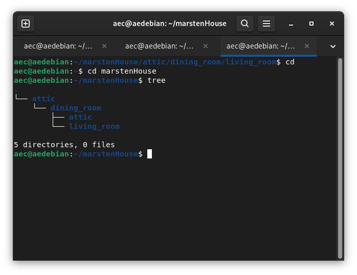
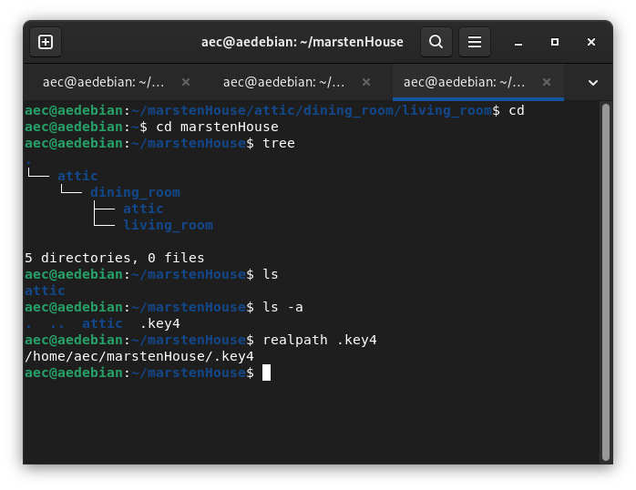
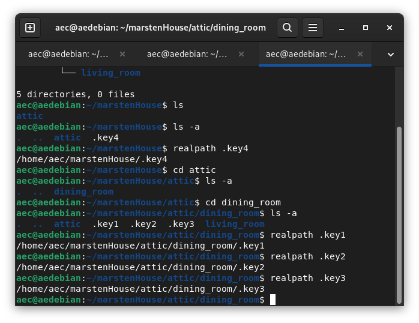
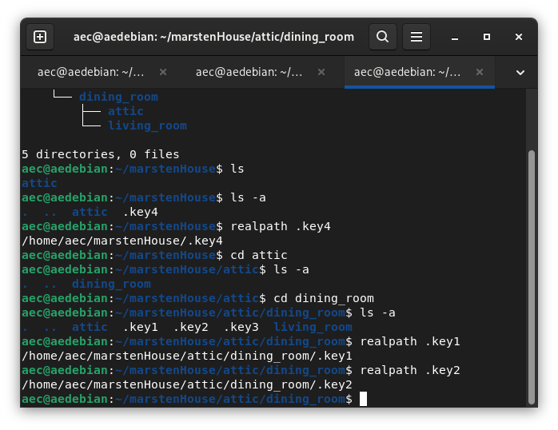
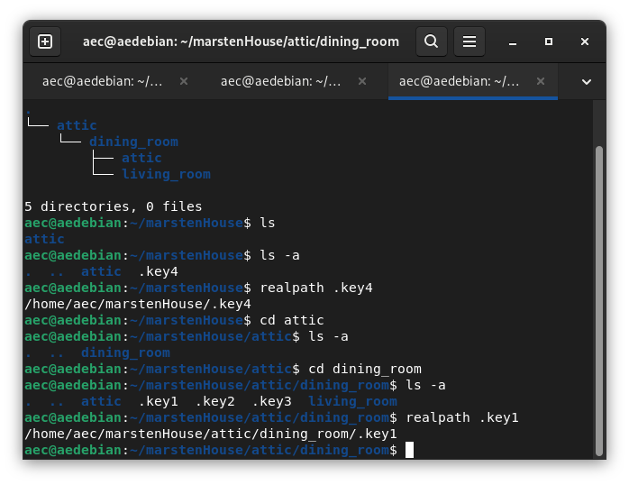
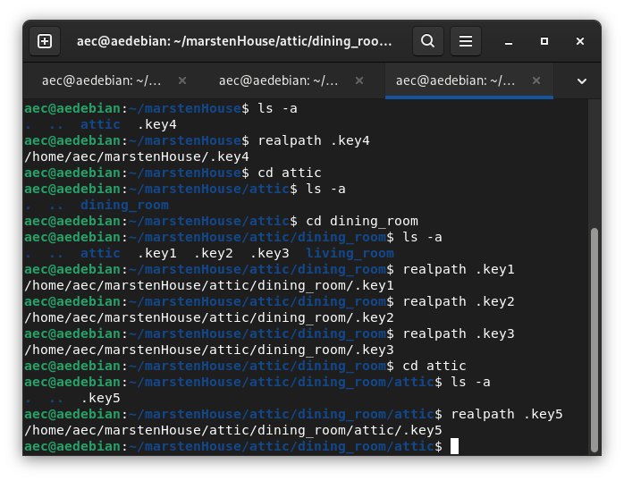

## LAB 5

* Question 1 | Moving around the file system 

Using pwd and cd with a relative path 

* Question 2 | The ls command 

* Challenge Question | MarstenHouse

MarstenHouse tree

Key 4

Key 3

Key 2

Key 1

Key 5
