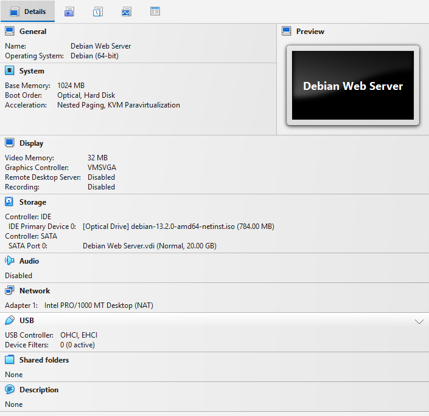
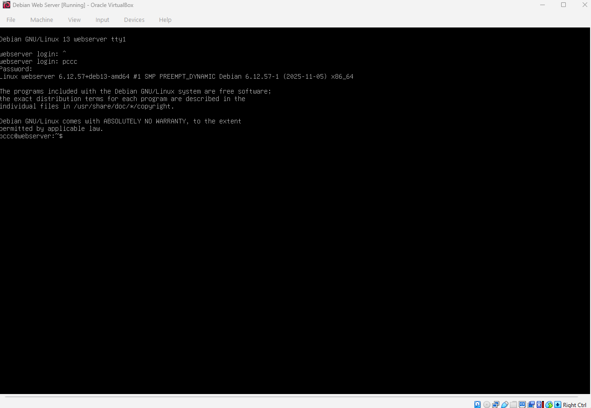
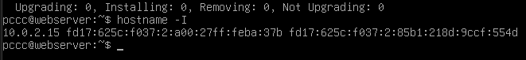
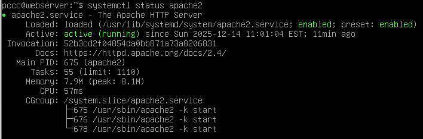
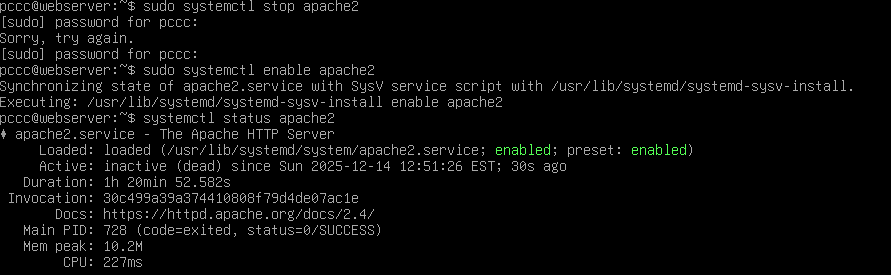
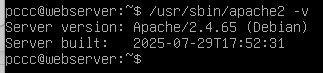
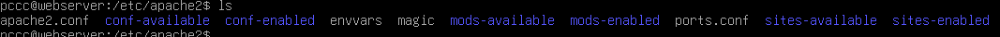
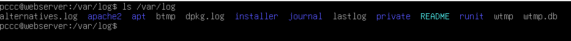
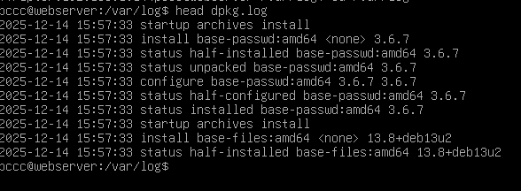

# Deliverable 2

## 1. What are the server hardware specifications (virtual machine settings)?

## 2. What is the Debian Login Screen?

## 3. What is the IP address of your Debian Server Virtual Machine? 

Command line: `hostname -I `

## 4. How do you work with the Firewall in Debian?

* UFW Firewall Commands – Summary Table

| Task | Command | Explanation |
|------|---------|-------------|
| Install UFW | `sudo apt install ufw` | Installs the firewall package |
| Enable firewall | `sudo ufw enable` | Turns the firewall on |
| Check status | `sudo ufw status` | Shows active rules and status |
| Disable firewall | `sudo ufw disable` | Turns the firewall off |
| Default rule: deny incoming | `sudo ufw default deny incoming` | Blocks all incoming connections |
| Default rule: allow outgoing | `sudo ufw default allow outgoing` | Allows all outgoing connections |
| Allow Apache | `sudo ufw allow 'Apache Full'` | Opens HTTP (80) and HTTPS (443) ports |
| Reload firewall | `sudo ufw reload` | Applies changes immediately |

## 5. What different commands do we use to work with Apache?

| File / Directory   | Purpose               |
| ------------------ | --------------------- |
| `apache2.conf`     | Main Apache config    |
| `ports.conf`       | Listening ports       |
| `envvars`          | Environment variables |
| `sites-available/` | Virtual host configs  |
| `sites-enabled/`   | Active virtual hosts  |
| `mods-available/`  | Available modules     |
| `mods-enabled/`    | Active modules        |
| `conf-available/`  | Extra configs         |
| `conf-enabled/`    | Enabled configs       |

**5.1.  What is the command you use to check if Apache is running?**
* The command is: `systemctl status apache2`

**5.2.  What is the command you use to stop Apache?**
* The command is: `sudo systemctl stop apache2 `

**5.3.  What is the command you use to restart Apache?**
* The command is: `sudo systemctl restart apache2`

**5.4.  What is the command used to test Apache configuration?**
* The command is: `sudo apachectl configtest`

**5/5.  What is the command used to check the installed version of Apache?**
* The command is: `/usr/sbin/apache2 -v`

**6.  What are some common configuration files for Apache?**

| File / Directory | Purpose |
|------------------|---------|
| `/etc/apache2/apache2.conf` | Main Apache configuration file |
| `/etc/apache2/ports.conf` | Defines listening ports |
| `/etc/apache2/envvars` | Apache environment variables |
| `/etc/apache2/sites-available/` | Available virtual host configurations |
| `/etc/apache2/sites-enabled/` | Enabled virtual host configurations |
| `/etc/apache2/mods-available/` | Available Apache modules |
| `/etc/apache2/mods-enabled/` | Enabled Apache modules |
| `/etc/apache2/conf-available/` | Additional configuration files |
| `/etc/apache2/conf-enabled/` | Enabled configuration files |

**7.  Where does Apache store logs?**
* Apache logs are stored at: `/var/log`

**8.  What are some basic commands we can use to review logs?**
* The most basic commands to review apache's log are:

| Command | Purpose |
|--------|---------|
| `cat` | Displays the entire log file |
| `less` | Views logs one page at a time |
| `more` | Simple paged log viewer |
| `tail` | Shows the last lines of a log file |
| `tail -f` | Monitors logs in real time |
| `head` | Shows the first lines of a log file |
| `grep` | Searches for text in logs |
| `wc -l` | Counts the number of log entries |

