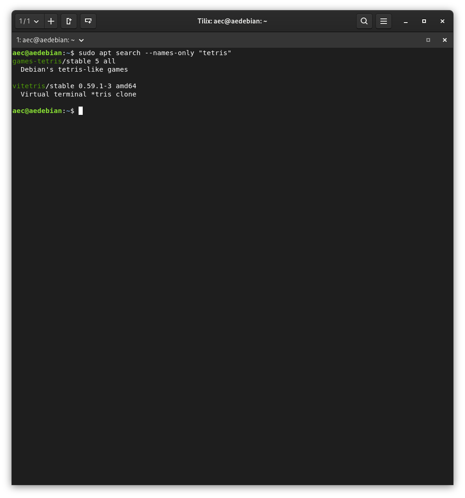
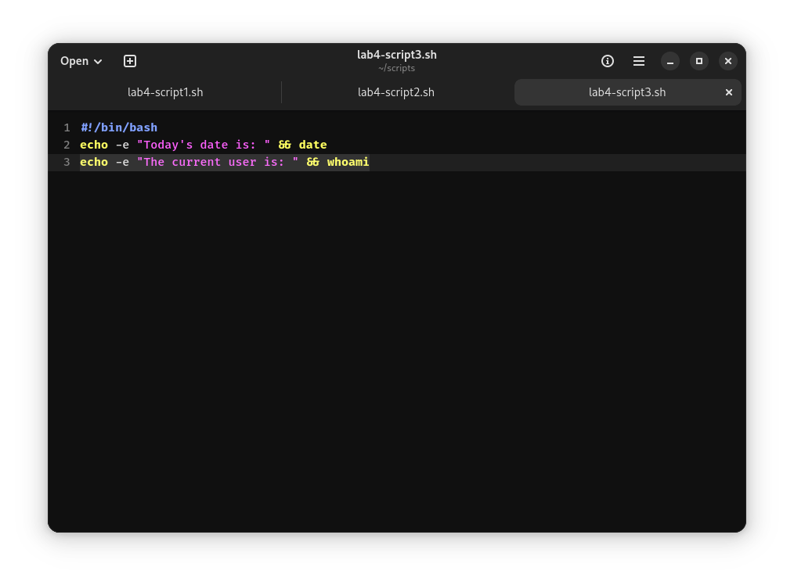
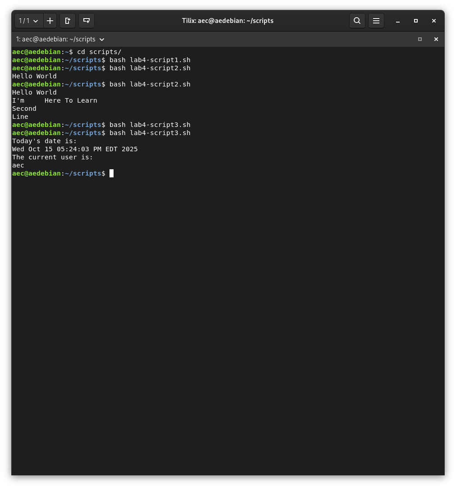
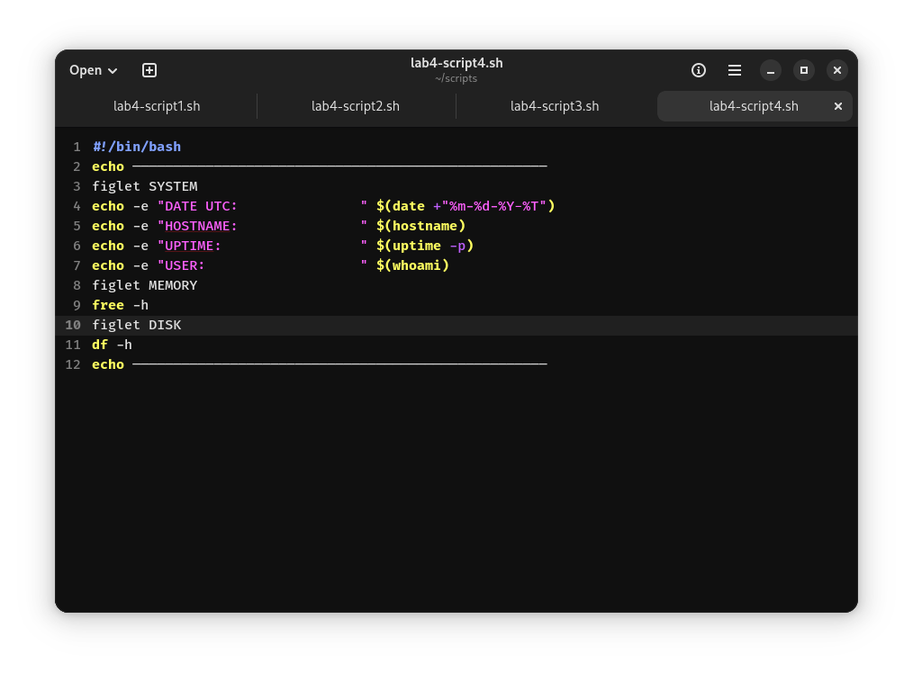
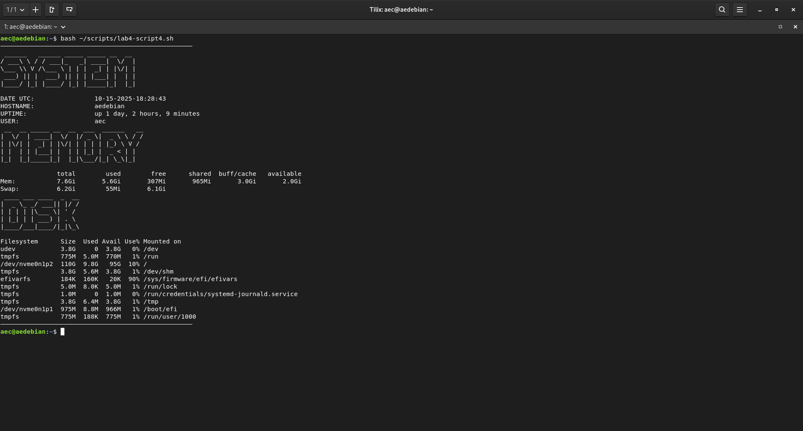

## Lab 4

* Searching for packages 

* Installing packages 

* Removing packages

* Shell Scripting

* Printing text to the screen 

* Running other commands in a script

* Dual Box Tilix

* Creating a script

* Challenge question 

