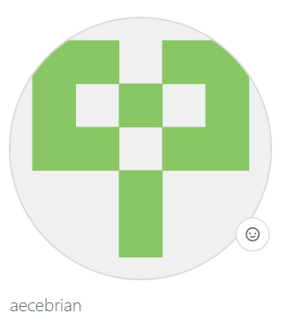

### What is Markdown?

Markdown is a markup language that lets you write plain text documents a  few lightweight formatting options.

### What is Git?

It is a open source software operating as a version control system. 

### What is GitHub?

Git is a platform where developers can work together in the same cloud/online workplace allowing organizational teams to elaborate trunk-base coding.

### What is Slack?

Slacks is a workplace messaging app usually used to communicate and share information in a secure and effective environment.  

