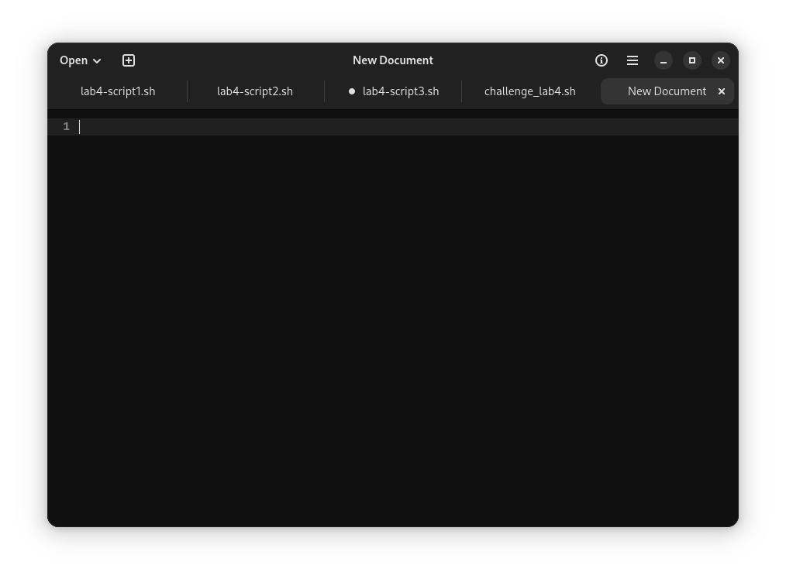

## Notes 4

* **How to install and remove software using the APT command?**

Installing:

* Open the Terminal

* type the next command and type password afterwards:
```
sudo apt install "app name"
```


* review the information


Removing:

* Open the Terminal

* type the next command and type password afterwards:
```
sudo apt remove "app name"
```

* review the information


* **How to create a shell script step by step including screenshots and how to run it. Try to be as detailed as possible.**

* Open gnome text edit

* type the next command on the first line:
```
#!/bin/bash
```

* Save as and name the shell script

* Open the shell script on the terminal
```
cd scripts/
```


Next command:

```
bash "script's file name"
```


Running:


