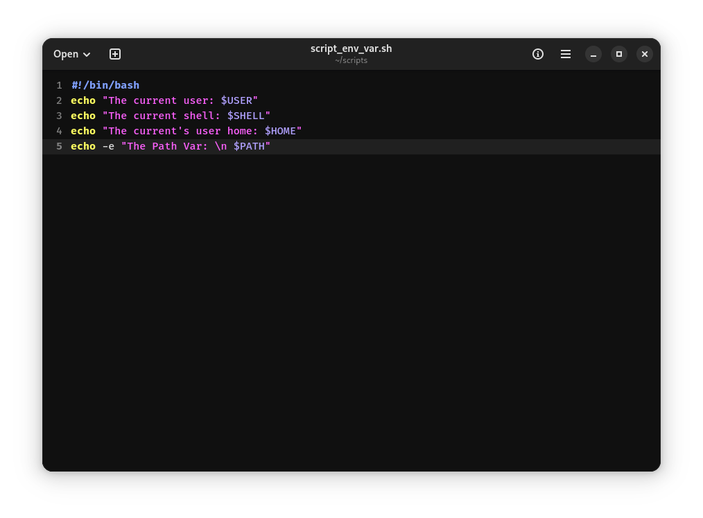
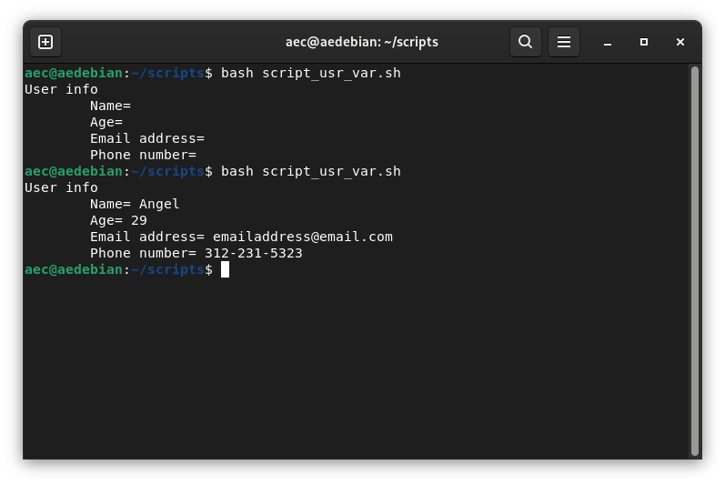

## Week Report 5

### Practice 1

### Practice 2

### Practice 3

### Shell Practice 2

### Shell Practice 3

### LAB 5 LINK:

[LAB 5](https://github.com/aecebrian/cis106/commit/6142ff45619836a48fb3acd0e94cb27cd653368d)

### NOTES 5 LINK:

[Notes 5](https://github.com/aecebrian/cis106/commit/373eef7854a05f318bc8cdc4a40b78177b80cd46)

